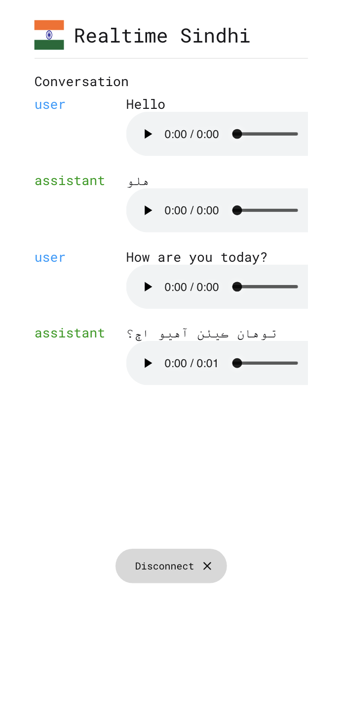

# Kyrgyz Real-Time Translator

A real-time translation application that converts text between Kyrgyz and other languages, providing instant translations with high accuracy.



## Features

- Real-time text translation to and from Kyrgyz
- Support for multiple languages
- User-friendly interface
- Fast and accurate translations
- Copy-to-clipboard functionality

## Installation

1. Clone the repository:
```bash
git clone https://github.com/yourusername/krygyz-realtime-translator.git
cd krygyz-realtime-translator
```

2. Install dependencies:
```bash
npm install
```

## Usage

1. Start the application:
```bash
npm start
```

2. Open your browser and navigate to `http://localhost:3000`

3. Enter text in the input field and see the translation appear in real-time

## Tech Stack

- React.js - Frontend framework
- Node.js - Backend runtime
- Express - Web server framework
- Translation API - For accurate Kyrgyz translations

## Contributing

Contributions are welcome! Please feel free to submit a Pull Request.

## License

This project is licensed under the MIT License - see the LICENSE file for details.

## Contact

For any questions or suggestions, please open an issue in the repository.# kyrgyz-realtime-translator
